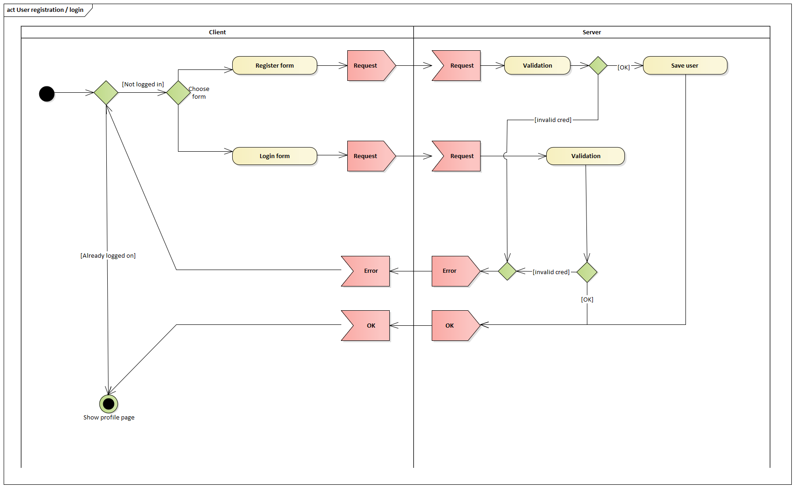
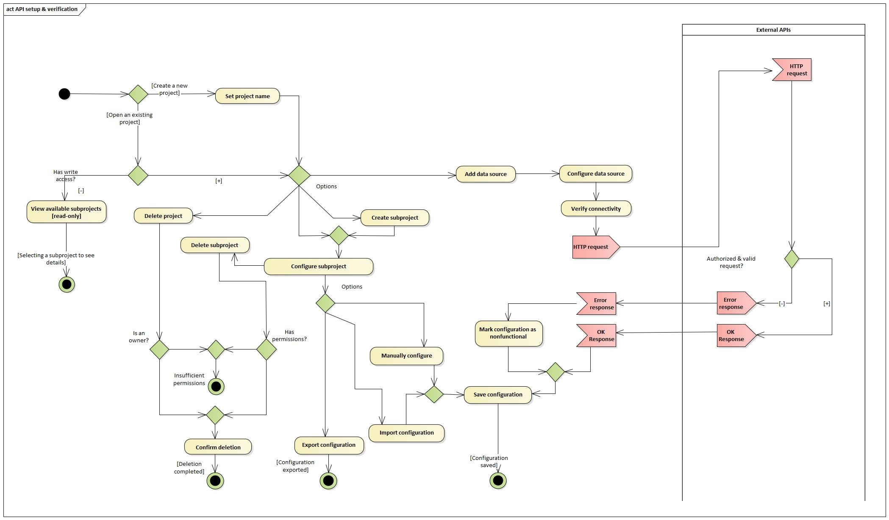
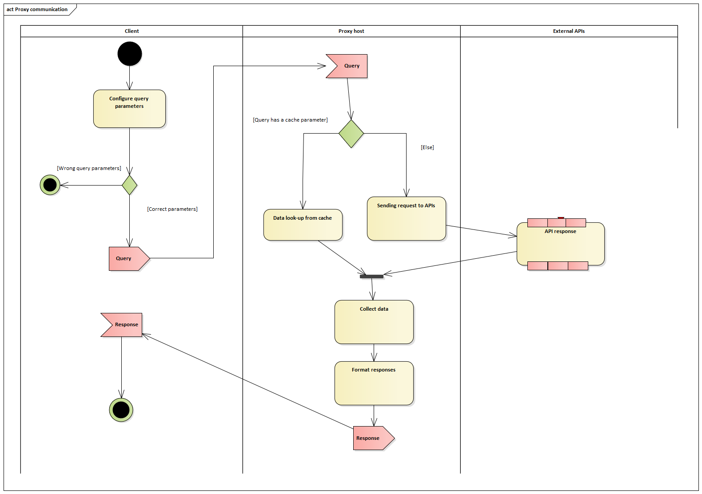

# Business process analytics 

## Process 1: User registration / login 
### Description
- Roles: User (client), Server (application) 
- Activities: 
  - User registration 
    - Goes trough verification process (whitelisting by administrator) 
    - Gets accepted, rejected 
  - User login 
    - Existing verified users can log in 
    - Login Success / Wrong credentials

### Diagram

## Process 2: API setup & verification 
### Description
- Roles: User (client), Server (proxy host), external API 
- Activities: 
  - Create / Edit / Delete a data source 
    - Specify a data source type: JSON / MongoDB / REST 
    - Specify endpoint type - GET, POST 
    - Setup access tokens 
    - Choose a custom caching interval 
    - Without sufficient permissions, user won’t be able to delete a data source in a shared project (doesn’t apply to personal ones). 
  - Connection testing (token authentication, API status), 
    - if connection test doesn’t work, user would still be able to save the desired configuration, but not to use it 
  - See data preview (request, data fetching) 
  - Save / Reset settings 
  - Import/Export data source configuration 
  - Create / Edit / Delete proxy (select from defined data sources, JSON preview) 
    - Activate/Deactivate proxy 
    - Backup data manually 

### Diagram

## Process 3: Data aggregation 
### Description
- Roles: Server (proxy host), API1, API2 
- Activities: 
  - Server gets a request from the user 
  - Proxy service sends request(s) to each specified data source in the project/collection 
  - Service concatenates/aggregates data from each source to single output 
  - Service responds with aggregated data in JSON format

### Diagram

## Process 4: User communication with proxy 
### Description
- Roles: User (client), Server (proxy host), external API 
- Activities: 
  - Client sends query to a server with desired settings 
  - Data look-up corresponding to query settings 
  - Data look-up from cache, or multiple sources 
  - Gather data and format answer 
  - Server sends formatted answer to user (client) 

## Diagram
