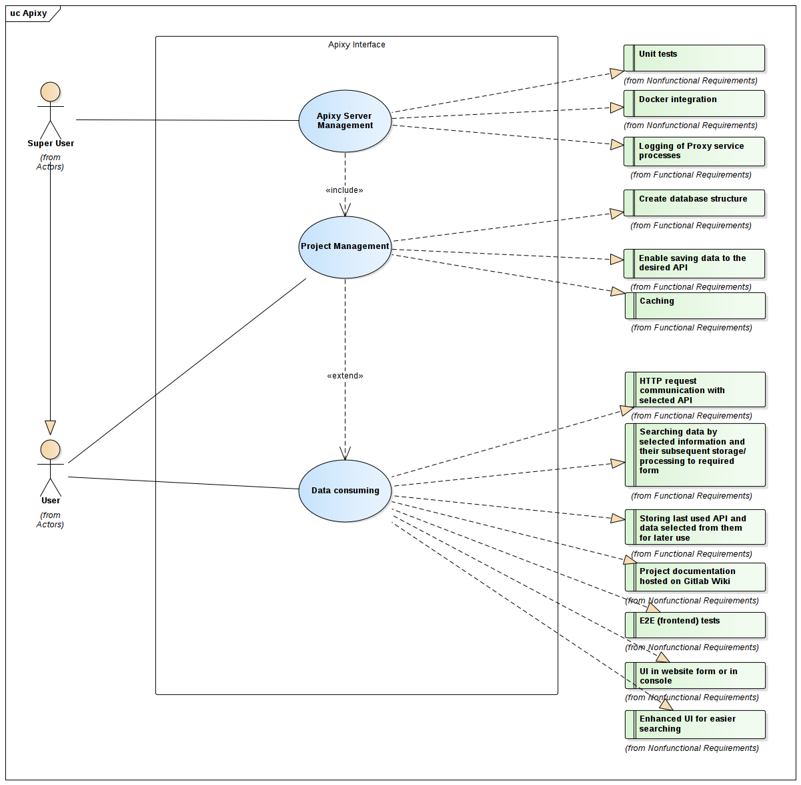

# Requirements analysis

## Requirements catalog 

- Must-have 
  - HTTP request communication with selected API **[F]** 
  - Create database structure. **[F]** 
  - Logging of Proxy service processes **[F]** 
  - Unit tests **[NF]** 

- Should-have 
  - Caching **[F]** 
  - UI in a website form. **[****N****F]** 
  - Docker integration **[NF]** 
  - Searching data by selected information and their subsequent storage/processing to required form **[F]** 

- Could-have 
  - Enhanced UI for easier searching **[NF]** 
  - Storing last used API and data selected from them for later use **[F]** 
  - Enable saving data to the desired API **[F]** 
  - Project documentation hosted on Gitlab Wiki **[NF]** 
  - SQL database data source support **[NF]** 
  - E2E (frontend) tests **[NF]** 
  - UI in console. **[NF]** 

- Will-not-have 
  - Searching in API that are not stored (program wont search API by itself). **[NF]** 

## User hierarchy in use cases 

Common two-level hierarchy across use cases: 

- User 
  - consumes the API, either directly or through a GUI 
  - receives aggregated data from predefined endpoints 
  - has access to API introspection tools 

- Superuser <extends User> 
  - project owner 
  - can define, edit or delete data sources and endpoint definitions 
  - can control per-endpoint/per-user permissions 

## Key use cases

### Use case 1

The user is a *project creator/owner.* The user has write permissions, so they can use CRUD operations. Basically, they are a Backend Developer, a DevOps Engineer, or similar. User defines APIs to be used, as well as how they will be used, defined and processed. The user can then make the project available to other team-members with read-only (or maybe write) permissions. 

Scenario: 

- User signs up / logs in on the FE side 

- User creates new or uses existing project/collection 
- User creates/updates 1..N data sources (REST API endpoint, NoSQL database, JSON file, possibly SQL database etc.) and for each defines how data should be obtained (HTTP method(s) for REST API, JSON path for file/MongoDB database, possibly SQL query for SQL database) and transformed/aggregated 
- User can test each data source, if it fetches data correctly, set it as WIP, update or delete it later 
- User can set caching preferences for each data source or project 
- If user has team mates and wants to share his work with them, user can send invites/arrange a read-only or even read-write permissions for specific users 

### Use case 2 

The user is a consumer of data aggregated by the proxy service, for instance a *F**rontend* *D**eveloper*. The user cannot manage projects or the way they define, use and aggregate data. Instead, they only make requests to the proxy and use the available data for their needs – i.e., a UI. 

Scenario: 

- User signs up / logs in and has an invite or proper permissions to access *User 1* project(s) 
- User can try to fetch data from already defined project/collection inside FE environment or obtain instructions of how to use it elsewhere (cURL example etc) 

### Use case 3 

User has no IT/technical background - they could be a *manager* or a *client*. The user has read-only access, so they can observe how data is processed and what the final data stream looks like. For this type of user, a friendly UI is preferred. 

Scenario: 

- User signs up / logs in and has an invite or proper permissions to access *User 1* project(s) 
- User can observe how

## Use case diagram

## Mapping use cases to requirements

Use case 1 - project creator/owner: 

- Unit tests 
- Create database structure 

- Docker integration 
- Enable saving data to the desired API 

Use case 2 - consumer: 

- Basic communication with API 

- Searching data by selected information and their subsequent storage/processing to required form 
- Storing last used API and data selected from them for later use 
- E2E (frontend) tests 

Use case 3 - client/non-it person: 

- Friendly UI in a website form.  
- Enhanced UI for easier searching 